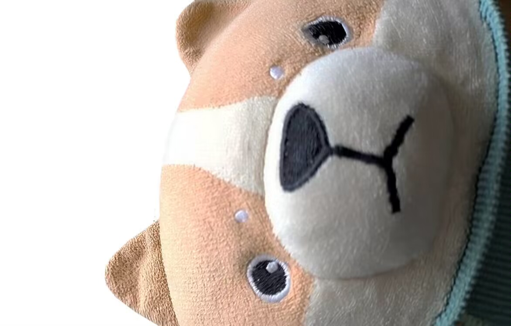

# ZHU GO

基于深度学习和蒙特卡洛树搜索的围棋机器人.

启发:

- Alpha Zero, Deep Mind <https://deepmind.google/discover/blog/alphazero-shedding-new-light-on-chess-shogi-and-go/>
- Deep Learning and the Game of Go, Kevin Ferguson and Max Pumperla <https://github.com/maxpumperla/deep_learning_and_the_game_of_go>
- Leela Zero, Leela Zero Team <https://github.com/leela-zero/leela-zero>


\* 这是猪, 他没怎么样, 只是他很可爱想给你们看看.

## Play

TODO

## Build

形如 `c****` 的目录是 C 扩展, 需要将它们编译并把编译产物手动复制到对应文件夹中.

```shell
python cboard/setup.py build_ext --inplace
mv boardmodule.[YOUR_ARCH].pyd cboard/boardmodule.[YOUR_ARCH].pyd
python cencoder/setup.py build_ext --inplace
mv encodermodule.[YOUR_ARCH].pyd cencoder/encodermodule.[YOUR_ARCH].pyd
...
```

## Usage

```shell
python main.py -c CONF
```

将依照配置文件启动棋局. 配置文件可修改棋局信息(如棋盘尺寸, 贴目等), 双方代理(如人类棋手, 传统随机蒙特卡洛树搜索算法bot等), 使用的 GUI等等. 具体可以参考 `conf/main/`.

```shell
python create.py -c CONF -p PATH
```

将按照配置文件创建模型. 具体可以参考 `conf/model/`.

## Architecture

查看 <a href="docs/blog/archietecture.md">architechture.md</a> 以获取更多细节.

## Train

TODO
